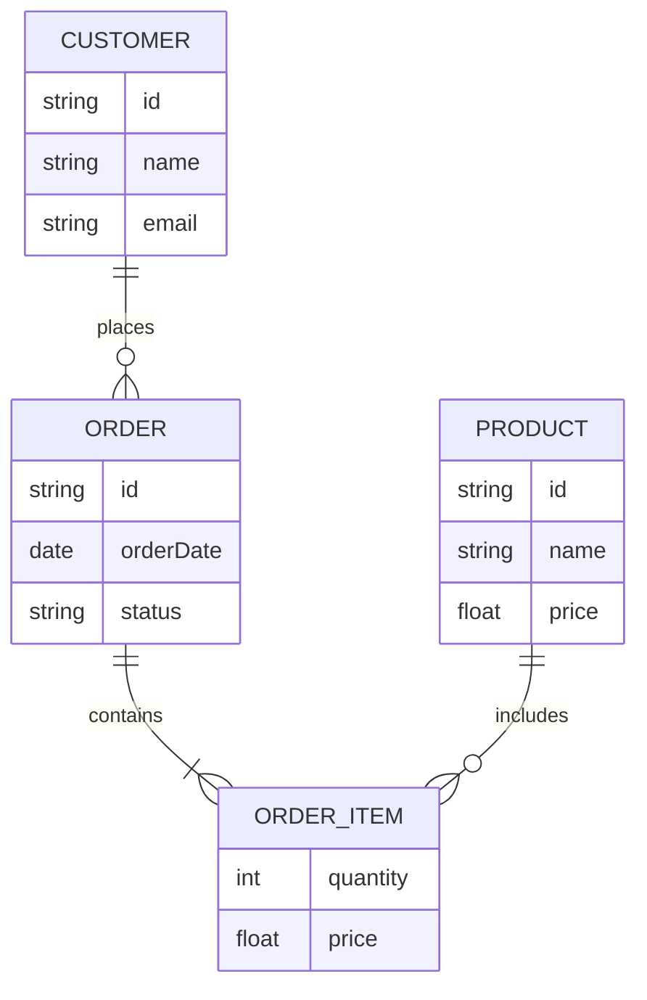

# Examen 2º trimestre BBDD

## Formato de entrega

Crea un repositorio privado en Github a partir de este, **recuerda borrar el .git** antes de hacer esto.

## Antes de empezar

0. Crea el repositorio y comprueba que puedas hacer un commit y pushes sin problemas.
1. Lee detenidamente la *Definición de la base de datos* y el resto del enunciado.
2. Asegúrate de entender también las partes de *Teoría* y *Extras* antes de comenzar.
3. Familiarízate con los entornos de docker para MySQL y PostgreSQL, lo necesitarás.
4. Haz commits con frecuencia, no esperes a tener todo el ejercicio hecho para hacer un commit, hazlo cada vez que completes una parte del ejercicio, **ESTO NO ES OPTATIVO**, la falta de commits o commits con mensajes poco descriptivos podrán restar puntos a tu ejercicio.
5. Durante la realización del examen, se permite el uso de *snippets de código*.
6. Un *snippet* debe **generar código**, debe estar **instalado** en el editor y solo servir para generar código que se ejecute, no puedes usar archivos de snippets para consultar *manualmente* mirandolos, debes usarlos en el propio editor.
7. Cualquier snippet que interfiera con la sección de teoría esta prohibido, usarlos puede restar puntos o, según el snippet, anular tu examen.

## Práctica

### Definición de la base de datos

En las siguientes preguntas diseñarás la estructura necesaria para la base de datos de una cadena de alquiler de vehiculos con varios centros en España.

La cadena dispone de 5 vehiculos diferentes:

- Toyota Corolla, con un precio de 50€ al dia.
- Ford Focus, con un precio de 55€ al dia.
- Volkswagen Golf, con un precio de 50€ al dia.
- BMW X3, con un precio de 95€ al dia.
- Mercedes C-Class, con un precio de 120€ al dia.

Todos los vehiculos actualmente tienen 4000 kilómetros.

La cadena recientemente ha firmado un contrato con cada una de estas marcas e incluirá más modelos de las mismas, ten en cuenta esto a la hora de diseñar tu base de datos.

La cadena dispone de 4 centros:

- Una en Granada, en la Avenida Andaluces 18.
- Dos en Malaga, una en la Avenida Comandante Garcí
a 12 y otra en el Centro Comercial Vialia.
- Otra en Sevilla, en Estación Santa Justa P2.

Cada centro dispone de **1 unidad de cada vehiculo**.

### Diseño de base de datos (5 Puntos)

Diseña un `schema.sql` que cumpla con la definición del problema descrito para una base de datos mySQL o postgreSQL.

El `schema` debe tener tanto la creación de tablas como la inserción de datos necesarios para cumplir con la definición anterior.

Puedes realizar esto en `mySQL` o `postgreSQL`, en el repositorio tienes dos entornos de docker para que puedas probar tu `schema` en ambos motores.

> Puedes (y se recomienda) modificar los entornos de docker para ajustarlos a tus necesidades.

El ejercicio se valorará según los siguientes criterios:

- Funcionalidad, el `schema` debe producir una base de datos funcional.
- Cumplimiento de formas normales, los datos de la base de datos propuesta se pueden dividir en multiples tablas, juzgar cuales merecen la pena separar y cuales te van a complicar cumplir con el ejercicio sin aportar algo positivo se valorarán.
- Uso de tipos de datos, haz un uso lógico de los tipos de datos a la hora de declarar columnas.
- Uso de subqueries, a la hora de insertar datos en columnas que vengan de otras tablas, puede tener sentido usar subqueries si simplifican la lectura de la query.
- Coherencia en la base de datos, el nombre de la base de datos debe tener sentido, la forma de nombrar las tablas y columnas deben ser consistentes.

### Join de vehiculos (1 punto)

Crea un `join-1.sql` que muestre los vehiculos de la base de datos con la siguiente información:

- Marca
- Modelo
- Precio de alquiler
- Kilómetros

### Join de vehiculos y centros (2 puntos)

Crea un `join-2.sql` que muestre los vehiculos de la cadena con la siguiente información:

- Centro en el que se encuentra
- Modelo del coche
- Marca
- Kilometros actuales
- Precio de alquiler

## Teoria (2 puntos)

1. ¿Que es una caché? ¿Para que se usa?
2. Si Redis es **tan** rápido, ¿por qué no usarlo en lugar de SQLite o MySQL?
3. ¿Que diferencias hay entre SQLite3 y MySQL?
4. ¿Que diferencias hay entre MySQL y PostgreSQL?
5. Explica el concepto de transacción, ACID y como se relacionan ambos.

## Extras

Solo puedes realizar una tarea extra como máximo.

### Conversión a otro motor (3 puntos)

Partiendo de tu `schema`, hazlo para otro motor, SQLite3, mySQL o PostgreSQL.

### Alquiler de vehiculos (2 puntos)

Añade una columna de `status` para controlar si los vehiculos están o no alquilados.

También deberás tener controlado *quien* lo ha alquilado.

### Diagrama ERD (2 puntos)

Realiza un diagrama ERD con la estructura de tu base de datos.

Puedes hacerla a papel, o utilizar la sintaxis de mermaidjs, por ejemplo:

> Este diagrama incluye ya todos los elementos de relaciones que necesitarás para el ejercicio.

### Puntos a mejorar (1 punto)

Redacta un documento llamado `mejoras.md` donde detectes puntos en los que tu base de datos tiene fallos o aspectos que se deberían cambiar en un futuro porque mejorarían algún aspecto de la misma.

Debes justificar los cambios, de manera clara y lo mas simple que puedas.
